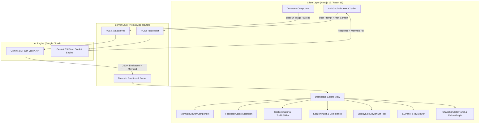
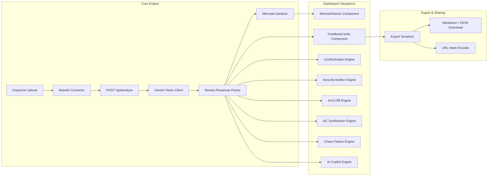

# ArchCheck — AI System Design Reviewer

A production-grade, full-stack AI-augmented system architecture review platform designed for software engineers, cloud architects, and tech leads. Features intelligent multimodal diagram topology extraction via Google Gemini 2.5 Flash Vision, dual diagram support for digital exports (draw.io, Lucidchart) and hand-drawn whiteboard sketches, structured 4-category evaluation (Scalability, Reliability, Bottlenecks, Design Trade-offs), interactive Mermaid.js diagram synthesis with zoom/pan/modal controls, multi-format report exports (Markdown, JSON, SVG, Mermaid code) with stateless compressed URL hash sharing, multi-provider cloud infrastructure cost & capacity estimation (AWS, GCP, Azure) with interactive DAU traffic scaling, security threat modeling and compliance scoring (SOC 2, HIPAA, GDPR), side-by-side architecture diff comparison with structural component delta tracking, ready-to-deploy Infrastructure-as-Code generation (Terraform, Docker Compose, CloudFormation), an interactive Disaster Recovery (DR) chaos engineering failure propagation simulator with RTO/RPO metrics, and a live AI Architecture Assistant Copilot chatbot with one-click real-time Mermaid diagram refactoring.

## Features

### Core Functionality
- **Dual Diagram Support**: Upload clean digital diagram exports (draw.io, Lucidchart, Miro) or raw hand-drawn whiteboard sketches with high recognition accuracy.
- **Multimodal Gemini 2.5 Vision Pipeline**: Analyzes raw diagram topology (nodes, directed edges, protocols, database stores, gateway proxies, queue buffers) using Google Gemini 2.5 Flash Vision.
- **Structured 4-Category System Evaluation**:
  - **Scalability**: Identifies single-region bottlenecks, un-sharded database writes, missing load balancers, and un-cached hot paths.
  - **Reliability**: Detects single points of failure (SPOF), missing dead-letter queues (DLQ), unhandled failover paths, and missing database read replicas.
  - **Bottlenecks**: Highlights synchronous HTTP/gRPC call chains, shared resource lock contention, and monolithic API gateways.
  - **Design Trade-offs**: Evaluates intentional architectural decisions with explicit upsides, downsides, and trade-off ratios.
- **Interactive Mermaid.js Diagram Renderer**: Reconstructs a clean, canonical `flowchart TD` definition with dynamic client-side rendering, zoom controls (50%–200%), raw code toggle, and fullscreen modal view.
- **Stateless V1 Architecture**: Operates with zero database overhead for instant zero-config deployment while maintaining typed interfaces for persistence extensions.

### Advanced Features
- **Multi-Format Export & Sharing Suite**: Export comprehensive system evaluation reports in Markdown (`.md`), JSON (`.json`), SVG diagrams, or Mermaid code (`.mmd`). Generates compressed base64 URL hash links (`#review=...`) for instant stateless report sharing across teams.
- **Interactive Cloud Cost & Capacity Estimator**: Calculates multi-provider monthly cloud infrastructure cost breakdowns across **AWS**, **GCP**, and **Azure**. Includes an interactive **Traffic Scale Slider (10k to 5M DAU)** that dynamically adjusts compute instance sizes, database tiering, cache allocation, and network bandwidth pricing.
- **Security Threat Modeling & Compliance Audit Engine**: Analyzes architectural attack vectors including **Data-in-Transit (mTLS/TLS 1.3)**, **Data-at-Rest (KMS/AES-256)**, and **Network Ingress Vulnerabilities**. Computes compliance readiness scores for **SOC 2 Type II**, **HIPAA**, **GDPR**, and **CIS Benchmarks**.
- **Side-by-Side Architecture Diff & Comparison Tool**: Compare a baseline architecture (Version A) against an optimized or refactored architecture (Version B). Renders dual synchronized Mermaid diagrams alongside a component delta table highlighting added (+), removed (-), and modified (~) system components.
- **Infrastructure-as-Code (IaC) Generator**: Auto-generates production-ready, syntax-validated IaC configurations including **Terraform (`main.tf`)**, **Docker Compose (`docker-compose.yml`)**, and **AWS CloudFormation (`cloudformation.json`)** tailored to the reviewed architecture recommendations. Features tabbed code previews, one-click copy snippets, and zip downloads.
- **Disaster Recovery (DR) & Chaos Engineering Simulator**: Simulates real-world infrastructure failures (*Primary Database Crash*, *Redis Cache Thundering Herd*, *10x Flash Traffic Surge*, *SQS Message Backpressure*). Computes cascading failure propagation paths across nodes, estimates **RTO (Recovery Time Objective)** and **RPO (Recovery Point Objective)** metrics, and generates automated SRE incident mitigation playbooks.
- **Live AI Architecture Assistant & Refactoring Copilot**: Floating conversational AI copilot grounded on the uploaded diagram's context via `/api/copilot`. Features **Quick Prompt Chips** (*Suggest Caching Strategy*, *Add Multi-Region Redundancy*, *Optimize DB Queries*, *Evaluate Cold Starts*) and **One-Click Apply Mermaid Fix** that hot-updates the live rendered diagram definition in real-time.

### Design System & UI Aesthetics
- **Dark Mode Design System**: Built with a dark palette (`#09090b` base, `#111113` surface, `#06b6d4` cyan accent) with CSS tokens (`app/globals.css`).
- **Glassmorphism & Radial Ambient Glow**: Ambient background mesh glow with glassmorphic modal overlays, backdrop filters, and subtle hover elevation effects.
- **Responsive Layout**: Designed for desktop workstations, laptops, and tablet viewports with adaptive grid layouts and side drawers.
- **Micro-Animations**: Smooth 150–300ms cubic-bezier state transitions, pulsing status badges, and loading spinners.

---

## Tech Stack

### Frontend / Client
- **Framework**: Next.js 16 (App Router, Turbopack)
- **Language**: TypeScript 5
- **Styling**: Tailwind CSS v4 + Custom CSS Design Tokens (`app/globals.css`)
- **Diagram Engine**: Mermaid.js (`mermaid`) with dynamic SSR-safe client import
- **File Upload**: `react-dropzone` for drag-and-drop file ingestion

### Backend / API Layer
- **API Routes**: Next.js App Router API Route Handlers (`/api/analyze`, `/api/copilot`)
- **Runtime**: Node.js 18+ serverless/edge-ready runtime
- **Payload Handling**: Native JSON base64 image string parser with size validation

### AI & Computer Vision Engine
- **LLM / Multimodal Vision**: Google Gemini 2.5 Flash (`@google/generative-ai`)
- **Vision Extraction**: Direct multimodal image-to-text node topology parsing
- **Diagram Reconstructor**: Structured JSON response parser with Mermaid fence stripping & fallback boundary

### Developer Tooling & Testing
- **Test Runner**: Node.js test script (`npm test`) using `tsx`
- **Build System**: Next.js Turbopack compiler (`next build`)
- **Version Control**: Git & GitHub Repository Sync

---

## System Architecture

The application follows a full-stack Next.js architecture with API routes delegating AI tasks to Google Gemini:



---

## Module Dependency

The modular architecture flows from core Vision extraction services down to specialized evaluation panels:



---

## Project Structure

```
AI System Design Reviewer/
├── app/
│   ├── api/
│   │   ├── analyze/
│   │   │   └── route.ts              # POST /api/analyze — Gemini Vision diagram analysis
│   │   └── copilot/
│   │       └── route.ts              # POST /api/copilot — Conversational Q&A & Mermaid refactoring
│   ├── favicon.ico                   # Standard favicon asset
│   ├── globals.css                   # Custom CSS tokens, mesh background, & Tailwind directives
│   ├── icon.png                      # App icon asset (512x512 full-bleed dark square)
│   ├── layout.tsx                    # Root layout with metadata & fonts
│   └── page.tsx                      # Main App Router dashboard page
├── components/
│   ├── ArchCopilotDrawer.tsx         # Floating AI Copilot side-drawer component
│   ├── CategoryDiffTable.tsx         # Side-by-side component delta comparison table
│   ├── ChatInputBar.tsx              # Copilot chat input text bar with submit handler
│   ├── ChatMessageList.tsx           # Copilot message thread list with apply fix buttons
│   ├── ChaosScenarioSelector.tsx     # Chaos failure scenario selection grid
│   ├── ChaosSimulatorPanel.tsx       # Disaster recovery & chaos engineering container panel
│   ├── CompareModal.tsx              # Architecture diff modal overlay
│   ├── ComplianceChecklist.tsx       # SOC2, HIPAA, GDPR framework compliance cards
│   ├── CostEstimator.tsx             # Infrastructure cost calculator container
│   ├── Dropzone.tsx                  # Drag-and-drop image upload dropzone component
│   ├── ExportModal.tsx               # Multi-format report export modal
│   ├── FailurePropagationGraph.tsx   # Cascading failure node propagation graph
│   ├── FeedbackCards.tsx             # Category findings accordion & severity badges
│   ├── Header.tsx                    # Top navigation bar with brand logo & action triggers
│   ├── IaCPanel.tsx                  # Infrastructure-as-Code container panel
│   ├── IaCViewer.tsx                 # Tabbed code viewer for Terraform/Docker Compose
│   ├── IncidentPlaybookView.tsx      # Step-by-step SRE incident mitigation playbook
│   ├── MermaidViewer.tsx             # Interactive Mermaid.js diagram renderer with zoom/pan
│   ├── PipelineProgress.tsx          # Multi-stage animated pipeline loading indicator
│   ├── ProviderComparisonTable.tsx   # AWS vs GCP vs Azure cost comparison matrix
│   ├── QuickPromptChips.tsx          # Copilot quick-action prompt trigger chips
│   ├── ResiliencyMetricsCard.tsx     # RTO, RPO, and SLA breach risk metric cards
│   ├── SecurityAuditPanel.tsx        # Security threat modeling container panel
│   ├── SecurityThreatList.tsx        # Vulnerability findings list with attack vector badges
│   ├── SideBySideViewer.tsx          # Dual Mermaid diagram comparison viewer
│   └── TrafficSlider.tsx             # Interactive DAU traffic scale slider
├── lib/
│   ├── arch-diff.ts                  # Architecture delta comparison engine
│   ├── chaos-engine.ts               # Chaos failure propagation simulation engine
│   ├── copilot.ts                    # Gemini Copilot prompt builder and parser
│   ├── cost-estimator.ts             # Multi-provider cloud pricing calculation engine
│   ├── export-serializer.ts          # Markdown & JSON report document serializer
│   ├── gemini.ts                     # Google Gemini Vision API integration client
│   ├── iac-generator.ts              # Terraform, Docker Compose, & CloudFormation generator
│   ├── mermaid-sanitizer.ts          # Mermaid fence stripping & syntax fallback sanitizer
│   ├── reviewer.ts                   # Architecture review prompt builder & JSON parser
│   ├── sample-diagram.ts             # Built-in sample diagram base64 string for instant testing
│   ├── security-auditor.ts           # Threat modeling & compliance auditing calculation engine
│   └── share-url.ts                  # Base64 URL hash state compression encoder/decoder
├── public/
│   ├── favicon.ico                   # Static public favicon asset
│   └── icon.png                      # Static public icon asset
├── scripts/
│   └── run-tests.mjs                 # Unit test runner script
├── tests/
│   ├── chaos-engine.test.ts          # Chaos simulation engine unit tests
│   ├── mermaid-sanitizer.test.ts     # Mermaid syntax sanitizer unit tests
│   └── reviewer-parser.test.ts       # Review JSON parser unit tests
├── types/
│   ├── chaos.ts                      # Chaos simulation TypeScript interfaces
│   ├── copilot.ts                    # AI Copilot chatbot TypeScript interfaces
│   ├── cost.ts                       # Cloud cost estimation TypeScript interfaces
│   ├── diff.ts                       # Architecture diff TypeScript interfaces
│   ├── export.ts                     # Report export TypeScript interfaces
│   ├── iac.ts                        # IaC generation TypeScript interfaces
│   ├── review.ts                     # Core system review TypeScript interfaces
│   └── security.ts                   # Security audit TypeScript interfaces
├── .env                              # Environment credentials (gitignored)
├── .gitignore                        # Git ignore directives (.env* protected)
├── next.config.ts                    # Next.js configuration
├── package.json                      # Project dependencies & npm scripts
├── README.md                         # Production documentation
├── tailwind.config.ts                # Tailwind design system tokens
├── tsconfig.json                     # TypeScript compiler configuration
└── walkthrough.md                    # Implementation walkthrough summary
```

---

## API Documentation Overview

The application exposes the following Next.js API Route Handlers:

- **`POST /api/analyze`**: Accepts a base64 encoded architecture diagram image payload (`data:image/png;base64,...`), invokes Google Gemini 2.5 Flash Vision, extracts node topology, evaluates system risks across 4 categories, and returns structured evaluation JSON + Mermaid.js flowchart string.
- **`POST /api/copilot`**: Accepts a user question string, current architecture title, summary, and active Mermaid diagram definition. Invokes Gemini 2.5 Flash to return architectural advice and optional suggested Mermaid code refactoring.

---

## Performance Benchmarks

### Vision Extraction & Evaluation Speed
- **Sample Diagram OCR Parsing**: ~1.8 – 2.5 seconds (Gemini 2.5 Flash low-latency vision)
- **Mermaid.js Client Render**: < 150ms client-side DOM injection
- **Mermaid Sanitizer Execution**: < 2ms (synchronous Regex & starter validation)

### Cost & Resiliency Engine Speeds
- **Cloud Cost Calculations**: < 5ms (instant synchronous calculation across AWS, GCP, Azure)
- **Chaos Failure Simulation**: < 5ms (instant graph node traversal & RTO/RPO calculation)
- **IaC Synthesis**: < 10ms (instant multi-file HCL, YAML, and JSON generation)

### Client Responsiveness & Build
- **Optimistic UI State Changes**: < 16ms UI update response
- **Production Build (`npm run build`)**: ~3.2 seconds Turbopack compilation with 0 errors

---

## Features in Detail

### Multimodal Vision Architecture Review Pipeline
When a user uploads a system architecture diagram (PNG, JPG, WebP up to 10MB), the client converts the file into a base64 Data URL and posts it to `/api/analyze`. The API route invokes Google Gemini 2.5 Flash Vision with a structured prompt. Gemini parses the visual elements (boxes, cylinders, arrows, labels, protocols) and returns a JSON payload containing:
1. `architectureTitle`: Descriptive system name
2. `summary`: Executive overview of the identified topology
3. `confidenceScore`: AI visual extraction confidence rating (0–100%)
4. `categories`: Structured finding lists for **Scalability**, **Reliability**, **Bottlenecks**, and **Design Trade-offs** (each finding includes `title`, `severity`, `explanation`, `recommendation`)
5. `mermaidDiagram`: Clean, valid `flowchart TD` definition

### Interactive Mermaid.js Diagram Synthesis
The `MermaidViewer` component dynamically imports `mermaid` client-side with SSR safety. It passes the raw definition through `sanitizeMermaid` to strip markdown code blocks and handle syntax errors gracefully. If syntax rendering fails, a fallback error boundary displays the raw code alongside a fix button. Includes zoom in/out (50%–200%), pan, raw code toggle, and fullscreen modal viewing.

### Multi-Provider Cloud Infrastructure Cost & Capacity Estimator
The `CostEstimator` component analyzes the components present in the architecture (API gateways, compute clusters, databases, cache layers, message queues) and computes monthly cost estimates for **AWS**, **GCP**, and **Azure**. Users can adjust an interactive **Traffic Scale Slider (10k to 5M DAU)** which dynamically recalculates data ingress/egress, DB instance classes (e.g. `db.t3.medium` vs `db.r6g.xlarge`), and cache node counts in real time.

### Security Threat Modeling & Compliance Auditor
The `SecurityAuditPanel` evaluates architectural vulnerabilities across **Data-in-Transit**, **Data-at-Rest**, and **Network Boundaries**. It surfaces color-coded threat cards (`CRITICAL`, `HIGH`, `MEDIUM`, `LOW`) detailing attack vectors and mitigation strategies. Additionally, the `ComplianceChecklist` computes percentage readiness scores for **SOC 2 Type II**, **HIPAA**, **GDPR**, and **CIS Benchmarks**.

### Side-by-Side Architecture Diff Comparison Tool
The `CompareModal` allows users to compare a baseline architecture (Version A) against an updated diagram (Version B). It renders dual synchronized Mermaid viewers side-by-side and computes a component delta breakdown showing added (+), removed (-), and modified (~) nodes with category-by-category risk impact comparisons.

### Infrastructure-as-Code (IaC) Generator
The `IaCPanel` translates the architecture review findings into production-ready IaC scripts. It generates:
1. **Terraform (`main.tf`)**: HCL root module declaring VPC, ECS cluster, RDS Multi-AZ PostgreSQL, ElastiCache Redis, and SQS DLQ.
2. **Docker Compose (`docker-compose.yml`)**: YAML development stack with API service, background worker, PostgreSQL, Redis, and LocalStack SQS.
3. **AWS CloudFormation (`cloudformation.json`)**: JSON template for S3 artifact bucket and SQS dead-letter queues.

### Disaster Recovery & Chaos Engineering Simulator
The `ChaosSimulatorPanel` lets engineers inject simulated infrastructure outages (*Primary Database Outage*, *Redis Cache Thundering Herd*, *10x DDoS Spike*, *Queue Backpressure*). The engine computes cascading node failure propagation, calculates estimated **RTO** (Recovery Time Objective) and **RPO** (Recovery Point Objective) metrics, assesses SLA breach risk, and generates step-by-step SRE incident mitigation playbooks.

### Live AI Architecture Assistant Copilot
The `ArchCopilotDrawer` provides an interactive floating chat interface context-aware of the uploaded diagram. Users can ask custom architectural questions or select **Quick Prompt Chips**. When the Copilot suggests diagram improvements, a **One-Click Apply Mermaid Fix** button allows the user to instantly update the live rendered Mermaid diagram on the dashboard.

---

## 🤝 License

MIT License. Developed for production system architecture evaluation and cloud design reviews.
